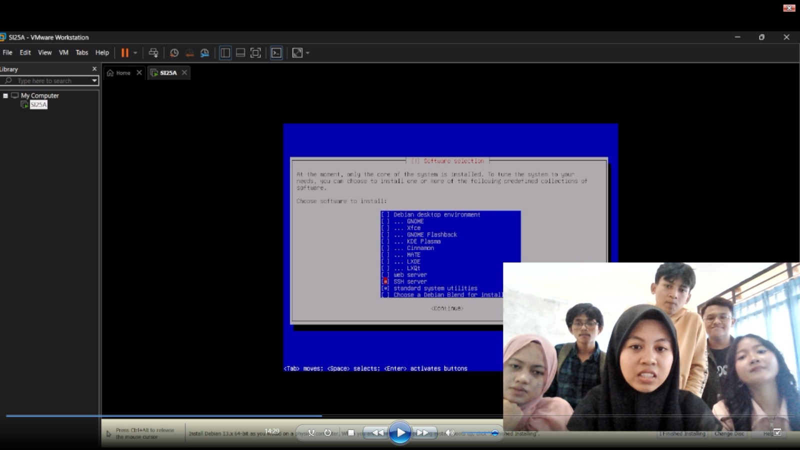
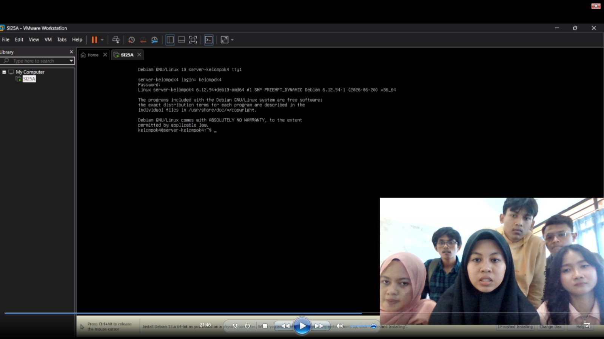
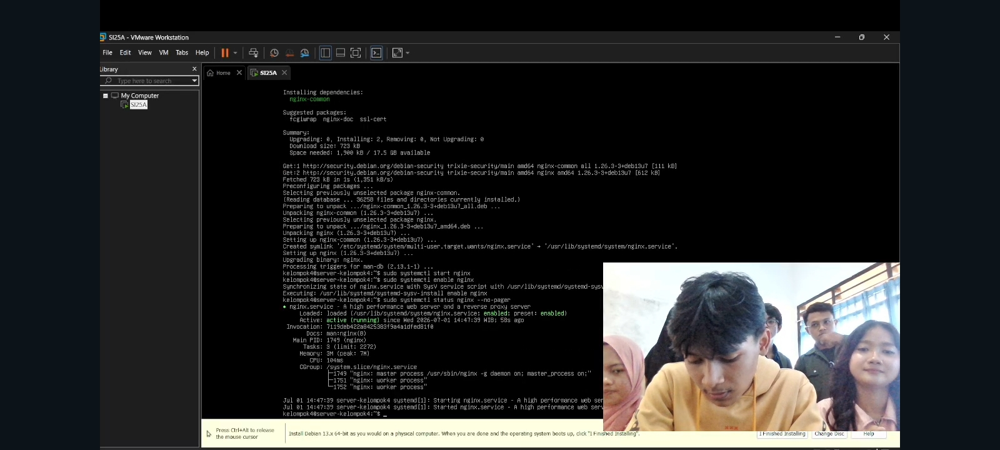
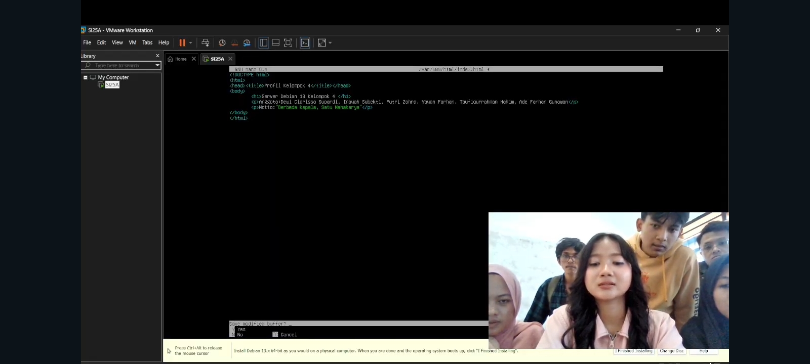
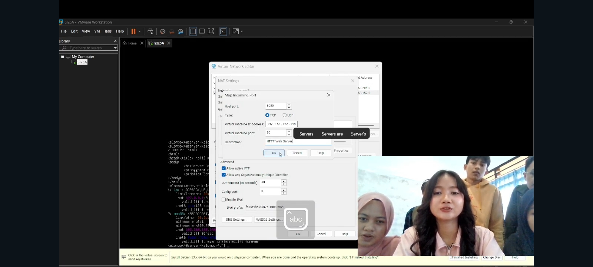
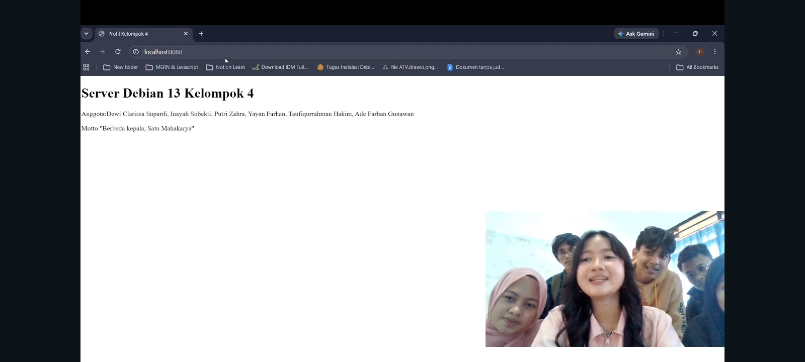

# sistem-operasi-si25-kelompok4
Tugas Instalasi Debian 13 Headless - Kelompok 4

# Laporan Tugas Kelompok: Instalasi Debian 13 Headless Web Server

**Mata Kuliah:** Sistem Operasi (SI-25)
**Program Studi:** Sistem Informasi, Universitas Galuh

## 👥 Anggota Kelompok 4 (Kelas SI-2025A)

1. Yayan Farhan - 7020250001
2. Taufiqurrahman Hakim - 7020250020
3. Ade Farhan Gunawan - 7020250015
4. Dewi Clarisa Supardi - 7020250045
5. Inayah Subekti - 7020250006
6. Putri Zahra - 7020250007

## 🎯 Spesifikasi Lingkungan Server

| Komponen | Keterangan |
|---|---|
| Hypervisor | VMware Workstation Pro |
| Sistem Operasi | Debian 13 (Bookworm) - Headless (CLI / Tanpa GUI) |
| Mode Jaringan VM | NAT |
| IP Address VM (Guest) | `192.168.x.x` (cek dengan `ip a` pada interface `ens33`) |
| Port Forwarding | Host Port `8080` → VM Port `80` (HTTP) |
| RAM / CPU / Disk (rekomendasi) | 1–2 GB RAM, 1 vCPU, 10–20 GB Disk |

---

## 🛠️ Langkah-Langkah & Dokumentasi Praktikum

### 0. Persiapan Sebelum Instalasi

1. Unduh file ISO Debian 13 (Bookworm) **netinst** dari situs resmi Debian.
2. Buka **VMware Workstation Pro** → `File > New Virtual Machine`.
3. Pilih **Typical (recommended)**, lalu arahkan ke lokasi file ISO Debian 13 yang sudah diunduh.
4. Isi nama VM, misal `Server-SI2025A-Kelompok4`, dan tentukan lokasi penyimpanan VM.
5. Tentukan kapasitas disk (disarankan 20 GB, "Store virtual disk as a single file").
6. Sebelum klik *Finish*, klik **Customize Hardware** untuk mengatur RAM (min. 1 GB) dan jumlah CPU sesuai kebutuhan.
7. Pastikan pengaturan jaringan VM menggunakan mode **NAT** (akan dikonfigurasi lebih lanjut di langkah 5).

---

### 1. Instalasi Debian 13 Headless

1. Nyalakan VM, lalu pada boot menu Debian pilih **Install** (mode teks, bukan Graphical Install) agar server benar-benar headless/CLI.
2. **Pilih Bahasa:** pilih `English` (memudahkan penulisan command & pencarian troubleshooting) atau `Indonesian` sesuai kesepakatan kelompok.
3. **Pilih Lokasi:** pilih `Indonesia`.
4. **Konfigurasi Keyboard:** pilih layout `American English`.
5. **Konfigurasi Jaringan:**
   * Debian akan otomatis mendeteksi interface `ens33` dan meminta DHCP. Biarkan proses ini berjalan.
   * **Hostname:** isi dengan `server-SI2025A` /sesuaikan kesepakatan kelompok.
   * **Domain name:** boleh dikosongkan.
6. **Set Up Users and Passwords:**
   * Isi password `root`.
   * Buat user biasa, misal `kelompok4`, beserta passwordnya. **Jangan gunakan root untuk aktivitas sehari-hari.**
7. **Partisi Disk (Partitioning):**
   * Pilih **Guided - use entire disk**.
   * Pilih disk `/dev/sda`.
   * Pilih skema **All files in one partition (recommended for new users)**.
   * Konfirmasi dengan memilih **Finish partitioning and write changes to disk**, lalu pilih **Yes**.
8. **Instalasi Sistem Dasar:** tunggu proses `Installing the base system` selesai.
9. **Package Manager (Mirror):**
   * Pilih **Yes** untuk *scan extra installation media* → `No` jika tidak ada media tambahan.
   * Pilih negara mirror `Indonesia`, lalu pilih mirror yang tersedia (misal `kartolo.sby.datautama.net.id` atau mirror kampus/ISP).
   * Kosongkan proxy HTTP jika tidak digunakan.
10. **Popularity Contest:** pilih `No` (opsional, tidak wajib).
11. **Software Selection (Tahap Penting):**
    * Hapus centang **Debian desktop environment** dan semua opsi desktop (GNOME, dll).
    * **Hanya centang:**
      - ✅ SSH server
      - ✅ standard system utilities
    * Ini memastikan Debian terinstall dalam mode **headless / tanpa GUI**.
    * *[Tambahkan screenshot proses menu software selection di bawah ini]*
      
12. **Install GRUB Bootloader:**
    * Pilih **Yes** untuk install GRUB boot loader.
    * Pilih disk `/dev/sda` sebagai lokasi instalasi GRUB.
13. Setelah instalasi selesai, VM akan reboot otomatis. Lepas media instalasi (ISO) jika diminta.
14. Login menggunakan user biasa yang sudah dibuat pada langkah 6.
    * *[Tambahkan screenshot tampilan login terminal Debian pertama kali di bawah ini]*
      

---

### 2. Konfigurasi User Sudo & Update Repositori

1. Login sebagai `root` terlebih dahulu (karena user biasa belum memiliki akses sudo):

2. Perbarui daftar paket dan sistem:
   ```bash
   apt update && apt upgrade -y
   ```
3. Instal paket `sudo`:
   ```bash
   apt install sudo -y
   ```
4. Tambahkan user biasa ke grup `sudo` (ganti `[nama-user-kelompok]` dengan user yang dibuat saat instalasi, misal `kelompok4`):
   ```bash
   usermod -aG sudo [nama-user-kelompok]
   ```
5. Reboot sistem agar perubahan grup diterapkan:
   ```bash
   reboot
   ```
6. Login kembali menggunakan user biasa, lalu uji akses sudo:

   Hasil yang benar akan menampilkan `root`, menandakan user sudah memiliki hak akses sudo.
   * *[Tambahkan screenshot hasil uji coba perintah sudo oleh user biasa di bawah ini]*
     

---

### 3. Instalasi Web Server Nginx & Tools Dasar

1. Instal tools dasar dan Nginx sekaligus:
   ```bash
   sudo apt install net-tools curl git nginx -y
   ```
2. Jalankan service Nginx:
   ```bash
   sudo systemctl start nginx
   ```
3. Aktifkan Nginx agar berjalan otomatis saat booting:
   ```bash
   sudo systemctl enable nginx
   ```
4. Cek status service Nginx untuk memastikan berjalan (`active (running)`):
   ```bash
   sudo systemctl status nginx
   ```
5. (Opsional) Cek IP address VM untuk pengujian lokal:
   ```bash
   ip a
   ```
6. (Opsional) Uji akses Nginx langsung dari dalam VM:
   ```bash
   curl http://localhost
   ```
   * *[Tambahkan screenshot status active running dari Nginx]*
     

---

### 4. Pembuatan Halaman Web Profil Kelompok

1. Buat cadangan file default Nginx (opsional tapi disarankan):
   ```bash
   sudo cp /var/www/html/index.html /var/www/html/index.html.bak
   ```
2. Edit file `index.html` menggunakan nano:
   ```bash
   sudo nano /var/www/html/index.html
   ```
3. Ganti isi file dengan HTML profil kelompok (nama anggota, NIM, mata kuliah, dsb). Simpan dengan `CTRL+O`, `Enter`, lalu keluar dengan `CTRL+X`.
4. Periksa hak akses file agar dapat dibaca oleh Nginx:
   ```bash
   sudo chown -R www-data:www-data /var/www/html
   sudo chmod -R 755 /var/www/html
   ```
5. Uji konfigurasi Nginx sebelum restart (mendeteksi error syntax jika ada):
   ```bash
   sudo nginx -t
   ```
6. Restart web server agar perubahan dimuat:
   ```bash
   sudo systemctl restart nginx
   ```
7. Uji tampilan halaman dari dalam VM:
   ```bash
   curl http://localhost
   ```
   * *[Tambahkan screenshot pengeditan index.html menggunakan nano editor]*
     

---

### 5. Konfigurasi Port Forwarding VMware & Pengujian Host

1. Pastikan mode jaringan VM diatur ke **NAT** (`VM > Settings > Network Adapter > NAT`).
2. Buka **Virtual Network Editor** di VMware:
   * Windows: `Edit > Virtual Network Editor` (jalankan sebagai Administrator).
3. Pilih network `VMnet8` (NAT), lalu klik **NAT Settings**.
4. Klik **Add** pada bagian Port Forwarding, lalu isi:
   * Host port: `8080`
   * Type: `TCP`
   * Virtual machine IP address: isi dengan IP VM hasil `ip a` (contoh: `192.168.x.x`)
   * Virtual machine port: `80`
5. Klik **OK** untuk menyimpan pengaturan.
   * *[Tambahkan screenshot pengaturan NAT Settings VMware]*
     
6. Buka browser di sistem operasi **host**, lalu akses:
   ```
   http://localhost:8080
   ```
7. Pastikan halaman profil kelompok berhasil tampil.
   * *[Tambahkan screenshot halaman profil kelompok yang berhasil diakses dari browser host di http://localhost:8080]*
     

---

### 6. Troubleshooting Umum

| Masalah | Kemungkinan Penyebab | Solusi |
|---|---|---|
| `sudo: command not found` | Paket sudo belum diinstal / belum login sebagai root | Login sebagai root, jalankan `apt install sudo -y` |
| User tidak bisa `sudo` | User belum masuk grup `sudo` atau belum reboot/logout | `usermod -aG sudo [user]`, lalu logout/login ulang |
| Nginx gagal start | Port 80 sudah dipakai proses lain | `sudo ss -tulpn | grep :80` untuk cek proses yang bentrok |
| Halaman tidak muncul di browser host | Port forwarding salah / IP VM berubah (DHCP) | Cek ulang IP dengan `ip a`, sesuaikan di NAT Settings |
| `Connection refused` di `localhost:8080` | Firewall Windows memblokir / VMware NAT service tidak jalan | Pastikan service `VMware NAT Service` berjalan di Windows |

---

## 🎥 Link Video Demo

[Tonton Video Demo Pengerjaan Tugas Kelompok di YouTube / Google Drive](https://youtube.com/...)

## 📝 Kesimpulan

Tuliskan simpulan dari praktikum yang telah dilakukan serta poin-poin penting yang didapatkan selama melakukan setup server Linux headless, misalnya:

- Pemahaman mengenai instalasi Debian mode teks tanpa antarmuka grafis (headless).
- Pentingnya konfigurasi user non-root dengan hak akses `sudo` demi keamanan sistem.
- Proses instalasi dan manajemen service web server (Nginx) menggunakan `systemctl`.
- Pemahaman konsep port forwarding pada hypervisor untuk menghubungkan jaringan host dan guest.
- Kendala yang dihadapi kelompok selama praktikum dan cara mengatasinya.
