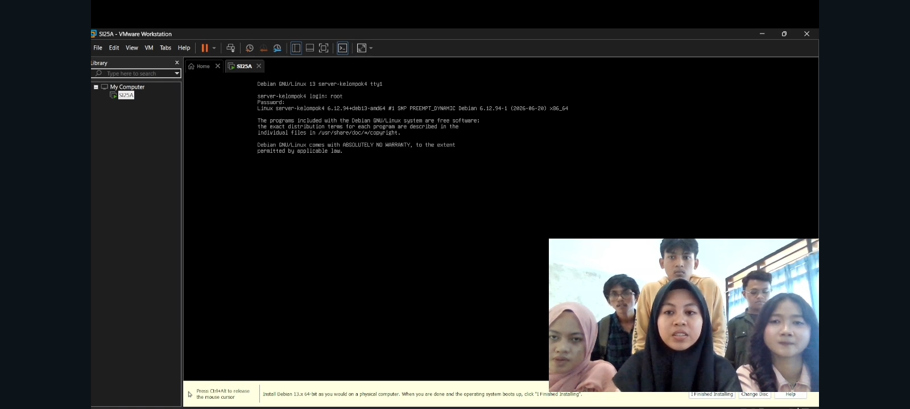

# sistem-operasi-si25-kelompok4
Tugas Instalasi Debian 13 Headless - Kelompok 4

# Laporan Tugas Kelompok: Instalasi Debian 13 Headless Web Server

**Mata Kuliah:** Sistem Operasi (SI-25)
**Program Studi:** Sistem Informasi, Universitas Galuh

## 👥 Anggota Kelompok 4 (Kelas SI-2025A / SI-2025B)

1. Yayan Farhan - 7020250001
2. Taufiqurrahman Hakim - 7020250020
3. Ade Farhan Gunawan - 7020250015
4. Dewi Clarisa Supardi - 7020250045
5. Inayah Subekti - 7020250006
6. Putri Zahra - 7020250007

## 🎯 Spesifikasi Lingkungan Server

| Komponen | Keterangan |
|---|---|
| Hypervisor | VMware Workstation Pro |
| Sistem Operasi | Debian 13 (Bookworm) - Headless (CLI / Tanpa GUI) |
| Mode Jaringan VM | NAT |
| IP Address VM (Guest) | `192.168.x.x` (cek dengan `ip a` pada interface `ens33`) |
| Port Forwarding | Host Port `8080` → VM Port `80` (HTTP) |
| RAM / CPU / Disk (rekomendasi) | 1–2 GB RAM, 1 vCPU, 10–20 GB Disk |

> **Apa itu "headless"?** Server headless adalah server yang dijalankan tanpa antarmuka grafis (GUI). Semua interaksi dilakukan lewat terminal/CLI. Ini menghemat resource (RAM, CPU, disk) dan lebih mendekati kondisi server produksi sesungguhnya, yang jarang dipasangi desktop environment.

---

## 🛠️ Langkah-Langkah & Dokumentasi Praktikum

### 0. Persiapan Sebelum Instalasi

**Tujuan tahap ini:** menyiapkan "wadah" (mesin virtual) tempat Debian akan diinstal, sebelum proses instalasi dimulai.

1. Unduh file ISO Debian 13 (Bookworm) **netinst** dari situs resmi Debian.
   *Penjelasan:* Varian **netinst** (network install) dipilih karena ukurannya kecil — hanya berisi installer dasar, sedangkan paket-paket lain akan diunduh dari mirror internet saat instalasi. Ini cocok untuk server headless yang tidak butuh banyak software bawaan.
2. Buka **VMware Workstation Pro** → `File > New Virtual Machine`.
   *Penjelasan:* Ini adalah wizard untuk membuat mesin virtual baru sebagai "komputer" tempat Debian akan berjalan secara terisolasi dari sistem operasi host (Windows/Mac/Linux Anda).
3. Pilih **Typical (recommended)**, lalu arahkan ke lokasi file ISO Debian 13 yang sudah diunduh.
   *Penjelasan:* Mode *Typical* menggunakan pengaturan default yang sudah cukup untuk kebutuhan umum, sehingga proses setup VM lebih cepat. File ISO ini akan dibaca layaknya "CD instalasi" oleh VM.
4. Isi nama VM, misal `Server-SI2025A-Kelompok4`, dan tentukan lokasi penyimpanan VM.
   *Penjelasan:* Nama ini hanya label di VMware, memudahkan identifikasi jika Anda memiliki banyak VM sekaligus.
5. Tentukan kapasitas disk (disarankan 20 GB, "Store virtual disk as a single file").
   *Penjelasan:* Kapasitas disk menentukan ruang penyimpanan maksimal VM. "Single file" dipilih agar file disk virtual lebih mudah dipindahkan/di-backup dibanding format multi-file.
6. Sebelum klik *Finish*, klik **Customize Hardware** untuk mengatur RAM (min. 1 GB) dan jumlah CPU sesuai kebutuhan.
   *Penjelasan:* Karena server ini headless (tanpa GUI) dan hanya menjalankan Nginx, kebutuhan resource jauh lebih kecil dibanding instalasi desktop biasa — 1 GB RAM umumnya sudah cukup untuk keperluan praktikum.
7. Pastikan pengaturan jaringan VM menggunakan mode **NAT** (akan dikonfigurasi lebih lanjut di langkah 5).
   *Penjelasan:* Mode **NAT** membuat VM bisa mengakses internet melalui koneksi host, sekaligus memungkinkan kita memetakan (forward) port tertentu dari host ke VM — ini yang nanti dipakai agar browser di host bisa mengakses web server di dalam VM.

---

### 1. Instalasi Debian 13 Headless

**Tujuan tahap ini:** memasang sistem operasi Debian 13 dalam mode teks (tanpa GUI) ke dalam VM yang sudah disiapkan.

1. Nyalakan VM, lalu pada boot menu Debian pilih **Install** (mode teks, bukan Graphical Install) agar server benar-benar headless/CLI.
   *Penjelasan:* Opsi **Install** menjalankan installer berbasis teks (ncurses), berbeda dengan **Graphical Install** yang menampilkan installer dalam mode grafis. Memilih mode teks membiasakan kita bernavigasi tanpa mouse, sesuai konsep server headless.
2. **Pilih Bahasa:** pilih `English` (memudahkan penulisan command & pencarian troubleshooting) atau `Indonesian` sesuai kesepakatan kelompok.
   *Penjelasan:* Bahasa ini hanya memengaruhi tampilan pesan installer, bukan bahasa sistem/terminal nantinya. `English` lebih disarankan karena sebagian besar dokumentasi dan pesan error Linux menggunakan bahasa Inggris.
3. **Pilih Lokasi:** pilih `Indonesia`.
   *Penjelasan:* Menentukan zona waktu (timezone) sistem, misalnya WIB/WITA/WIT, agar log dan waktu server sesuai dengan lokasi Anda.
4. **Konfigurasi Keyboard:** pilih layout `American English`.
   *Penjelasan:* Layout keyboard ini menentukan pemetaan tombol fisik ke karakter yang dihasilkan. `American English` (QWERTY US) adalah layout paling umum dan kompatibel dengan sebagian besar keyboard.
5. **Konfigurasi Jaringan:**
   * Debian akan otomatis mendeteksi interface `ens33` dan meminta DHCP. Biarkan proses ini berjalan.
     *Penjelasan:* **DHCP** (Dynamic Host Configuration Protocol) membuat VM otomatis mendapat alamat IP dari router/NAT VMware, tanpa perlu diatur manual.
   * **Hostname:** isi dengan `server-SI2025A` atau `server-SI2025B` (sesuaikan kelas kelompok).
     *Penjelasan:* Hostname adalah nama identitas server di jaringan, akan muncul di prompt terminal (`user@hostname:~$`) dan memudahkan identifikasi server jika ada banyak server dalam satu jaringan.
   * **Domain name:** boleh dikosongkan.
     *Penjelasan:* Domain name biasanya dipakai di lingkungan jaringan perusahaan (misal `kampus.ac.id`); untuk praktikum lokal ini tidak diperlukan.
6. **Set Up Users and Passwords:**
   * Isi password `root`.
     *Penjelasan:* `root` adalah superuser/administrator tertinggi di Linux dengan akses penuh ke seluruh sistem.
   * Buat user biasa, misal `kelompok4`, beserta passwordnya. **Jangan gunakan root untuk aktivitas sehari-hari.**
     *Penjelasan:* Praktik terbaik keamanan Linux adalah tidak login sebagai root secara langsung. User biasa nantinya akan diberi akses `sudo` (langkah 2) sehingga tetap bisa menjalankan perintah administratif tapi lebih terkontrol dan tercatat (auditable).
7. **Partisi Disk (Partitioning):**
   * Pilih **Guided - use entire disk**.
     *Penjelasan:* Opsi ini membuat installer otomatis mempartisi seluruh disk, cocok untuk pemula/praktikum dibanding partisi manual yang lebih kompleks.
   * Pilih disk `/dev/sda`.
     *Penjelasan:* `/dev/sda` adalah nama device disk virtual pertama yang dikenali Linux (satu-satunya disk pada VM ini).
   * Pilih skema **All files in one partition (recommended for new users)**.
     *Penjelasan:* Semua direktori sistem (`/`, `/home`, `/var`, dll) digabung dalam satu partisi, lebih sederhana dibanding skema terpisah (`/home` dan `/var` di partisi berbeda) yang biasanya dipakai di server produksi skala besar.
   * Konfirmasi dengan memilih **Finish partitioning and write changes to disk**, lalu pilih **Yes**.
     *Penjelasan:* Langkah ini bersifat final — begitu dikonfirmasi, disk akan diformat dan seluruh data sebelumnya (jika ada) akan hilang.
8. **Instalasi Sistem Dasar:** tunggu proses `Installing the base system` selesai.
   *Penjelasan:* Installer mengekstrak dan memasang paket-paket inti sistem operasi (kernel Linux, utilitas dasar) ke partisi yang baru dibuat.
9. **Package Manager (Mirror):**
   * Pilih **Yes** untuk *scan extra installation media* → `No` jika tidak ada media tambahan.
     *Penjelasan:* Opsi ini mengecek apakah ada CD/DVD instalasi tambahan selain ISO netinst; karena kita hanya pakai satu ISO, jawab `No`.
   * Pilih negara mirror `Indonesia`, lalu pilih mirror yang tersedia (misal `kartolo.sby.datautama.net.id` atau mirror kampus/ISP).
     *Penjelasan:* **Mirror** adalah server penyedia paket Debian. Memilih mirror lokal (Indonesia) membuat proses unduh paket lebih cepat karena jarak jaringan lebih dekat.
   * Kosongkan proxy HTTP jika tidak digunakan.
     *Penjelasan:* Proxy hanya diisi jika jaringan Anda mengharuskan akses internet melalui proxy (umum di jaringan kampus/kantor tertentu).
10. **Popularity Contest:** pilih `No` (opsional, tidak wajib).
    *Penjelasan:* Fitur ini mengirim data statistik paket yang digunakan ke Debian secara anonim untuk membantu pengembangan Debian. Tidak wajib dan tidak memengaruhi fungsi server.
11. **Software Selection (Tahap Penting):**
    * Hapus centang **Debian desktop environment** dan semua opsi desktop (GNOME, dll).
    * **Hanya centang:**
      - ✅ SSH server
      - ✅ standard system utilities
    * *Penjelasan:* Ini adalah tahap paling menentukan sifat "headless" server. **SSH server** memungkinkan kita mengakses server dari jarak jauh via terminal (mis. PuTTY/OpenSSH client), sedangkan **standard system utilities** menyediakan tools dasar Linux (seperti `nano`, `less`, `wget`). Semua paket desktop sengaja tidak dicentang agar sistem tetap ringan dan murni berbasis CLI.
    * *[Tambahkan screenshot proses menu software selection di bawah ini]*
      
12. **Install GRUB Bootloader:**
    * Pilih **Yes** untuk install GRUB boot loader.
    * Pilih disk `/dev/sda` sebagai lokasi instalasi GRUB.
    * *Penjelasan:* **GRUB** (Grand Unified Bootloader) adalah program yang pertama kali dijalankan saat komputer/VM dinyalakan, bertugas memuat kernel Linux. Tanpa GRUB terpasang di disk, sistem tidak akan bisa booting.
13. Setelah instalasi selesai, VM akan reboot otomatis. Lepas media instalasi (ISO) jika diminta.
    *Penjelasan:* Melepas ISO mencegah VM boot ulang ke installer alih-alih ke sistem yang baru terpasang.
14. Login menggunakan user biasa yang sudah dibuat pada langkah 6.
    *Penjelasan:* Ini adalah tanda instalasi berhasil — sistem sudah bisa menerima login dan siap dikonfigurasi lebih lanjut.
    * *[Tambahkan screenshot tampilan login terminal Debian pertama kali di bawah ini]*
      

---

### 2. Konfigurasi User Sudo & Update Repositori

**Tujuan tahap ini:** memberi user biasa hak akses administratif secara terkontrol, dan memastikan seluruh paket sistem dalam kondisi terbaru.

1. Login sebagai `root` terlebih dahulu (karena user biasa belum memiliki akses sudo):
   ```bash
   su -
   ```
   *Penjelasan:* Perintah `su -` (*switch user*) berpindah sesi ke user `root` beserta environment login-nya. Ini diperlukan karena user biasa belum terdaftar di grup `sudo`, sehingga belum bisa menjalankan perintah administratif.
2. Perbarui daftar paket dan sistem:
   ```bash
   apt update && apt upgrade -y
   ```
   *Penjelasan:* `apt update` menyinkronkan daftar paket terbaru yang tersedia dari mirror (tidak menginstal apa pun, hanya memperbarui "katalog"). `apt upgrade -y` kemudian meng-upgrade seluruh paket terpasang ke versi terbaru; `-y` otomatis menjawab "yes" pada konfirmasi.
3. Instal paket `sudo`:
   ```bash
   apt install sudo -y
   ```
   *Penjelasan:* Debian minimal terkadang tidak menyertakan `sudo` secara default. Paket ini diperlukan agar user biasa nantinya bisa menjalankan perintah dengan hak akses root secara sementara, tanpa harus login penuh sebagai root.
4. Tambahkan user biasa ke grup `sudo` (ganti `[nama-user-kelompok]` dengan user yang dibuat saat instalasi, misal `kelompok4`):
   ```bash
   usermod -aG sudo [nama-user-kelompok]
   ```
   *Penjelasan:* `usermod -aG` menambahkan (append) user ke grup tambahan (`-G`) tanpa menghapus keanggotaan grup lain (`-a`). Anggota grup `sudo` diizinkan menjalankan perintah `sudo` sesuai konfigurasi di `/etc/sudoers`.
5. Reboot sistem agar perubahan grup diterapkan:
   ```bash
   reboot
   ```
   *Penjelasan:* Keanggotaan grup baru pada dasarnya hanya berlaku pada sesi login baru. Reboot (atau minimal logout/login ulang) memastikan sesi shell user membaca ulang informasi grup.
6. Login kembali menggunakan user biasa, lalu uji akses sudo:
   ```bash
   sudo whoami
   ```
   *Penjelasan:* Perintah `whoami` menampilkan nama user yang sedang aktif menjalankan perintah. Jika hasilnya `root` meskipun kita login sebagai user biasa, artinya `sudo` berhasil dikonfigurasi — user berhasil "meminjam" hak akses root untuk satu perintah tersebut.
   * *[Tambahkan screenshot hasil uji coba perintah sudo oleh user biasa di bawah ini]*
     

---

### 3. Instalasi Web Server Nginx & Tools Dasar

**Tujuan tahap ini:** memasang perangkat lunak web server beserta tools pendukung, lalu memastikan web server berjalan.

1. Instal tools dasar dan Nginx sekaligus:
   ```bash
   sudo apt install net-tools curl git nginx -y
   ```
   *Penjelasan tiap paket:*
   - `net-tools` — menyediakan perintah jaringan klasik seperti `ifconfig`, `netstat`.
   - `curl` — untuk menguji/mengambil konten dari URL langsung via terminal (dipakai di langkah pengujian).
   - `git` — sistem kontrol versi, berguna jika nanti perlu mengunduh/mengelola kode dari repository.
   - `nginx` — perangkat lunak web server yang akan melayani halaman web kita ke browser.
   
   Karena sudah login sebagai user biasa, seluruh perintah instalasi diawali `sudo` agar dijalankan dengan hak akses administratif.
2. Jalankan service Nginx:
   ```bash
   sudo systemctl start nginx
   ```
   *Penjelasan:* `systemctl start` mengaktifkan (menjalankan) service Nginx untuk sesi saat ini. Secara default setelah instalasi, Nginx biasanya sudah otomatis berjalan, tapi perintah ini memastikan service aktif.
3. Aktifkan Nginx agar berjalan otomatis saat booting:
   ```bash
   sudo systemctl enable nginx
   ```
   *Penjelasan:* Tanpa perintah `enable`, service Nginx hanya berjalan sampai VM dimatikan/di-reboot dan tidak otomatis menyala kembali. `enable` membuat systemd menjalankan Nginx otomatis setiap kali sistem boot — penting untuk server yang harus selalu online.
4. Cek status service Nginx untuk memastikan berjalan (`active (running)`):
   ```bash
   sudo systemctl status nginx
   ```
   *Penjelasan:* Perintah ini menampilkan status terkini service: apakah sedang berjalan (`active (running)`), berhenti (`inactive`), atau gagal (`failed`), beserta beberapa baris log terakhir untuk membantu diagnosis jika ada masalah.
5. (Opsional) Cek IP address VM untuk pengujian lokal:
   ```bash
   ip a
   ```
   *Penjelasan:* Menampilkan seluruh interface jaringan beserta alamat IP yang terpasang. IP pada interface `ens33` inilah yang akan dipakai saat mengisi port forwarding di VMware (langkah 5).
6. (Opsional) Uji akses Nginx langsung dari dalam VM:
   ```bash
   curl http://localhost
   ```
   *Penjelasan:* Perintah ini mengirim request HTTP ke web server yang berjalan di VM itu sendiri (`localhost` = `127.0.0.1`). Jika Nginx berfungsi normal, output-nya berupa kode HTML halaman default Nginx — cara cepat memverifikasi web server aktif sebelum mengujinya lewat browser di host.
   * *[Tambahkan screenshot status active running dari Nginx]*
     

---

### 4. Pembuatan Halaman Web Profil Kelompok

**Tujuan tahap ini:** mengganti halaman default Nginx dengan halaman HTML berisi profil kelompok.

1. Buat cadangan file default Nginx (opsional tapi disarankan):
   ```bash
   sudo cp /var/www/html/index.html /var/www/html/index.html.bak
   ```
   *Penjelasan:* Sebelum mengubah/menimpa file asli, membuat salinan (`.bak`) adalah praktik yang baik agar file default masih bisa dikembalikan jika terjadi kesalahan saat editing.
2. Edit file `index.html` menggunakan nano:
   ```bash
   sudo nano /var/www/html/index.html
   ```
   *Penjelasan:* `/var/www/html/` adalah direktori root default Nginx — semua file di sini yang dilayani ke browser saat diakses. `nano` adalah text editor sederhana berbasis terminal, cocok untuk edit cepat di server headless (tidak butuh GUI seperti Notepad).
3. Ganti isi file dengan HTML profil kelompok (nama anggota, NIM, mata kuliah, dsb). Simpan dengan `CTRL+O`, `Enter`, lalu keluar dengan `CTRL+X`.
   *Penjelasan:* `CTRL+O` (*Write Out*) menyimpan perubahan ke file, `Enter` mengonfirmasi nama file yang sama, dan `CTRL+X` keluar dari nano kembali ke terminal.
4. Periksa hak akses file agar dapat dibaca oleh Nginx:
   ```bash
   sudo chown -R www-data:www-data /var/www/html
   sudo chmod -R 755 /var/www/html
   ```
   *Penjelasan:* `chown` mengubah kepemilikan (owner & group) file/folder menjadi `www-data`, yaitu user default yang menjalankan proses Nginx. `chmod 755` memberi izin baca+eksekusi untuk semua orang serta baca/tulis/eksekusi untuk pemilik, memastikan Nginx punya izin membaca file tanpa membuka celah keamanan berlebihan (mis. izin tulis untuk semua orang).
5. Uji konfigurasi Nginx sebelum restart (mendeteksi error syntax jika ada):
   ```bash
   sudo nginx -t
   ```
   *Penjelasan:* Perintah ini memeriksa validitas file konfigurasi Nginx tanpa benar-benar menerapkannya. Jika ada kesalahan syntax pada konfigurasi (bukan pada HTML), lebih baik terdeteksi di sini daripada menyebabkan Nginx gagal restart.
6. Restart web server agar perubahan dimuat:
   ```bash
   sudo systemctl restart nginx
   ```
   *Penjelasan:* Meskipun perubahan file HTML statis sebenarnya langsung terbaca tanpa restart, me-restart service adalah kebiasaan baik untuk memastikan tidak ada cache/konfigurasi lama yang tertinggal.
7. Uji tampilan halaman dari dalam VM:
   ```bash
   curl http://localhost
   ```
   *Penjelasan:* Sama seperti langkah sebelumnya, ini memastikan isi HTML yang baru sudah benar-benar tersaji oleh Nginx sebelum diuji dari browser host.
   * *[Tambahkan screenshot pengeditan index.html menggunakan nano editor]*
     

---

### 5. Konfigurasi Port Forwarding VMware & Pengujian Host

**Tujuan tahap ini:** menghubungkan jaringan komputer host (tempat browser dijalankan) dengan jaringan VM (tempat Nginx berjalan), karena secara default VM dalam mode NAT tidak bisa diakses langsung dari host tanpa pengaturan tambahan.

1. Pastikan mode jaringan VM diatur ke **NAT** (`VM > Settings > Network Adapter > NAT`).
   *Penjelasan:* Mode NAT membuat VM berada di balik "router virtual" milik VMware, mirip perangkat di rumah yang terhubung ke internet lewat router. Karena itu, port di dalam VM (port 80) perlu dipetakan secara eksplisit ke port di host (port 8080) agar host bisa "menembus" ke VM.
2. Buka **Virtual Network Editor** di VMware:
   * Windows: `Edit > Virtual Network Editor` (jalankan sebagai Administrator).
   *Penjelasan:* Tool ini mengatur perilaku jaringan virtual VMware (NAT, Host-only, Bridged) secara global, termasuk aturan port forwarding.
3. Pilih network `VMnet8` (NAT), lalu klik **NAT Settings**.
   *Penjelasan:* `VMnet8` adalah nama default segmen jaringan NAT di VMware — semua VM yang diatur ke mode NAT berbagi segmen jaringan virtual ini.
4. Klik **Add** pada bagian Port Forwarding, lalu isi:
   * Host port: `8080`
   * Type: `TCP`
   * Virtual machine IP address: isi dengan IP VM hasil `ip a` (contoh: `192.168.x.x`)
   * Virtual machine port: `80`
   *Penjelasan:* Aturan ini secara sederhana berarti "setiap request yang masuk ke port 8080 pada host, teruskan ke port 80 pada VM dengan IP tersebut". Port 80 dipilih karena itu port standar HTTP tempat Nginx melayani permintaan web.
5. Klik **OK** untuk menyimpan pengaturan.
   * *[Tambahkan screenshot pengaturan NAT Settings VMware]*
     
6. Buka browser di sistem operasi **host**, lalu akses:
   ```
   http://localhost:8080
   ```
   *Penjelasan:* `localhost` merujuk ke komputer host itu sendiri. Karena aturan port forwarding sudah dibuat, request ke port 8080 di host otomatis diteruskan ke port 80 di VM — tanpa perlu tahu IP VM secara langsung dari browser.
7. Pastikan halaman profil kelompok berhasil tampil.
   *Penjelasan:* Jika halaman muncul, ini membuktikan seluruh rantai konfigurasi berhasil: instalasi Debian → service Nginx aktif → file HTML tersaji dengan benar → jaringan NAT & port forwarding terhubung dengan tepat.
   * *[Tambahkan screenshot halaman profil kelompok yang berhasil diakses dari browser host di http://localhost:8080]*
     

---

### 6. Troubleshooting Umum

| Masalah | Kemungkinan Penyebab | Solusi |
|---|---|---|
| `sudo: command not found` | Paket sudo belum diinstal / belum login sebagai root | Login sebagai root, jalankan `apt install sudo -y` |
| User tidak bisa `sudo` | User belum masuk grup `sudo` atau belum reboot/logout | `usermod -aG sudo [user]`, lalu logout/login ulang |
| Nginx gagal start | Port 80 sudah dipakai proses lain | `sudo ss -tulpn \| grep :80` untuk cek proses yang bentrok |
| Halaman tidak muncul di browser host | Port forwarding salah / IP VM berubah (DHCP) | Cek ulang IP dengan `ip a`, sesuaikan di NAT Settings |
| `Connection refused` di `localhost:8080` | Firewall Windows memblokir / VMware NAT service tidak jalan | Pastikan service `VMware NAT Service` berjalan di Windows |

---

## 🎥 Link Video Demo

[Tonton Video Demo Pengerjaan Tugas Kelompok di YouTube / Google Drive](https://youtube.com/...)

## 📝 Kesimpulan

Tuliskan simpulan dari praktikum yang telah dilakukan serta poin-poin penting yang didapatkan selama melakukan setup server Linux headless, misalnya:

- Pemahaman mengenai instalasi Debian mode teks tanpa antarmuka grafis (headless).
- Pentingnya konfigurasi user non-root dengan hak akses `sudo` demi keamanan sistem.
- Proses instalasi dan manajemen service web server (Nginx) menggunakan `systemctl`.
- Pemahaman konsep port forwarding pada hypervisor untuk menghubungkan jaringan host dan guest.
- Kendala yang dihadapi kelompok selama praktikum dan cara mengatasinya.
